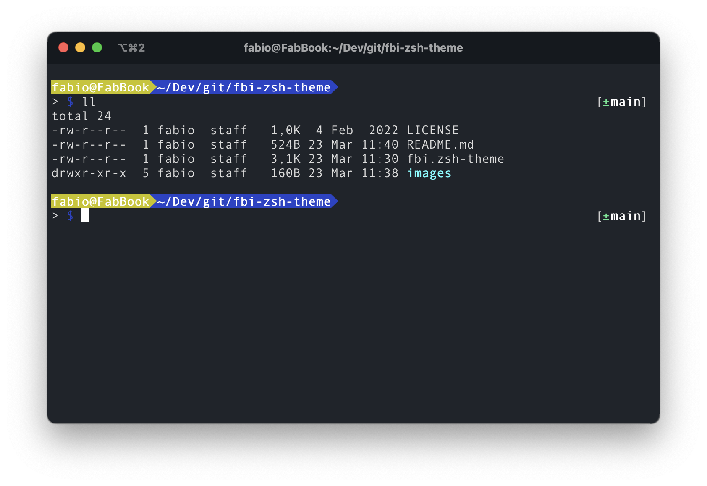
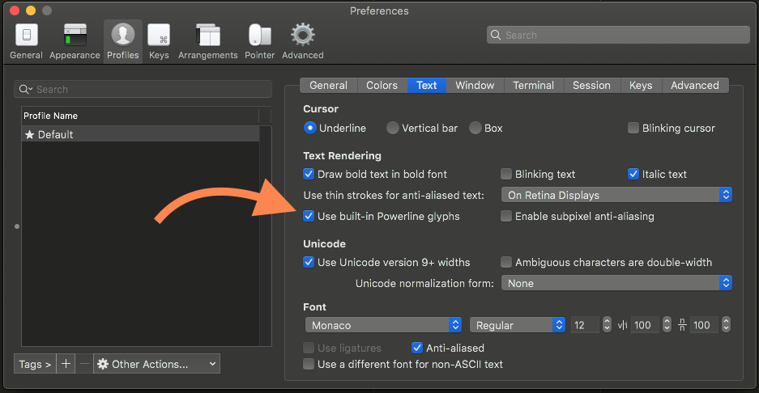
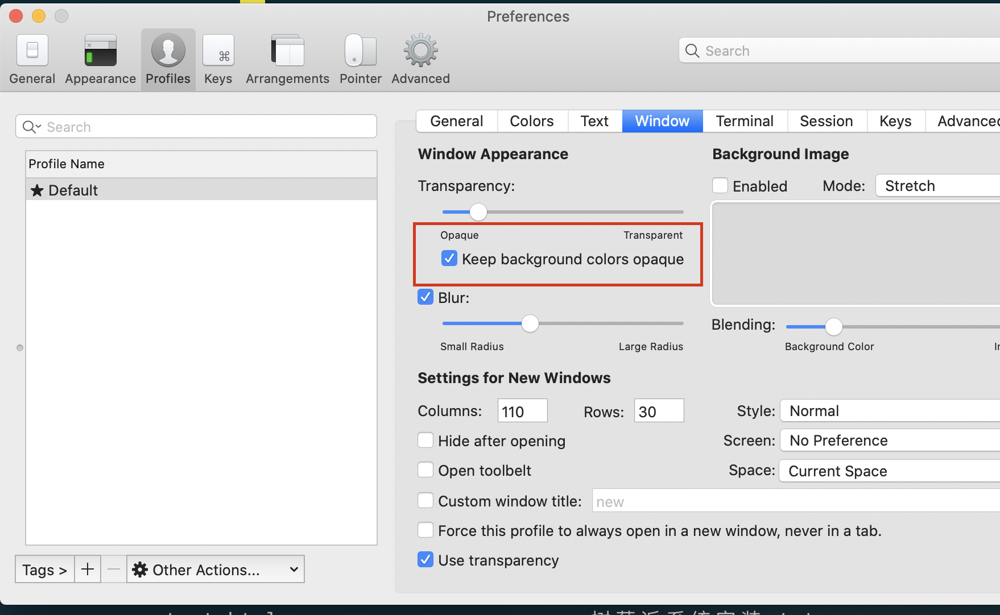

# ohmyzsh-theme-bureau
A fork and customization of the default theme Bureau for ohmyzsh

# Install

Run `make link` to symlink `fbi.zsh-theme` to your custom them directory (`~/.oh-my-zsh/custom/themes`).
Alternatively, you can run `make install` to copy of the file.

# Configuration

Install iTerm2. Then select the following configurations.

Enable Powerline glyphs:

Enable opaque background colors:

